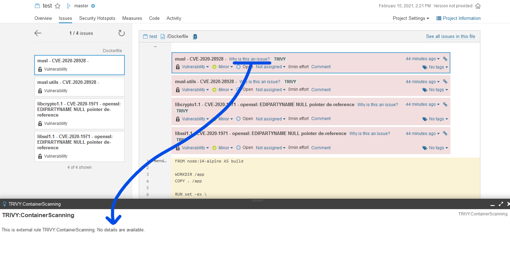

A [custom template](sonarqube.tpl) that Trivy can use, to generate a Sonarqube friendly output.  It is based on the [Sonarqube Generic Issue Import Format](https://docs.sonarqube.org/latest/analysis/generic-issue/). 

## Instructions

Start the Sonarqube server locally.

    docker-compose up

Do the first time setup in Sonarqube - reset your admin password, create a project called test, generate a key for that project. 

### Create a normal Trivy HTML output

```
docker run --rm -v /var/run/docker.sock:/var/run/docker.sock \
                -v ${PWD}/trivy-cache/:/root/.cache/ \
                -v ${PWD}/trivy-output:/output \
                aquasec/trivy image --exit-code 1 --no-progress \
                --format template --template "@contrib/html.tpl" -o /output/report.html \
                mendhak/http-https-echo:15
```
A `report.html` appears in trivy-output.  You can use this for comparison purposes. 

### Create a custom Sonarqube JSON output

This step will use the sonarqube.tpl as a template:

```
docker run --rm -v /var/run/docker.sock:/var/run/docker.sock \
                -v ${PWD}/trivy-cache/:/root/.cache/ \
                -v ${PWD}/sonarqube.tpl:/input/sonarqube.tpl \
                -v ${PWD}/trivy-output:/output aquasec/trivy \
                image --exit-code 1 --no-progress \
                --format template --template "@/input/sonarqube.tpl" \
                -o /output/report.json \
                mendhak/http-https-echo:15
```

A `report.json` appears in trivy-output. 

### Send the generated report to Sonarqube

Finally you can send the generated report.json to Sonarqube using Sonar Scanner CLI.  Substitute the SONAR_LOGIN value below with your project's token.  

```
docker run --rm \
           -e SONAR_HOST_URL=http://host.docker.internal:9000 \
           -e SONAR_LOGIN=xxxxxxxxxxxxxxxxxxxxxxx \
           -v ${PWD}:/usr/src sonarsource/sonar-scanner-cli \
           -Dsonar.projectKey=test \
           -Dsonar.externalIssuesReportPaths=/usr/src/trivy-output/report.json 
```
Go to the Sonarqube test project and look for the vulnerabilities there. 

### Screenshot


### Notes

RuleID is hardcoded to ContainerScanning.  What should it be instead?

I couldn't find a good place to put the 'fixed' version in.  The message field is already crowded. 

I can't find a way to add more details in the Generic Issue Import JSON format.  See:



I've also posted [a feature request on the Sonarsource Community forum](https://community.sonarsource.com/t/add-the-ability-to-populate-the-rules-details-panel-when-using-the-generic-issue-import-format/38702).  

